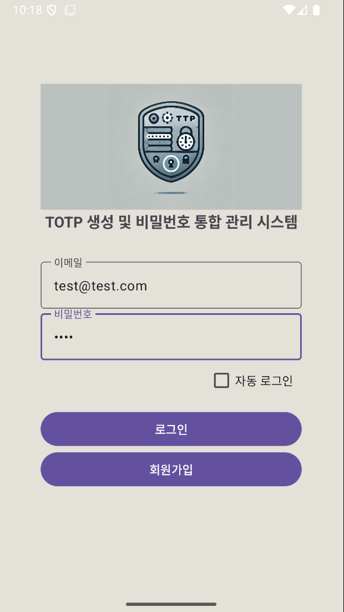
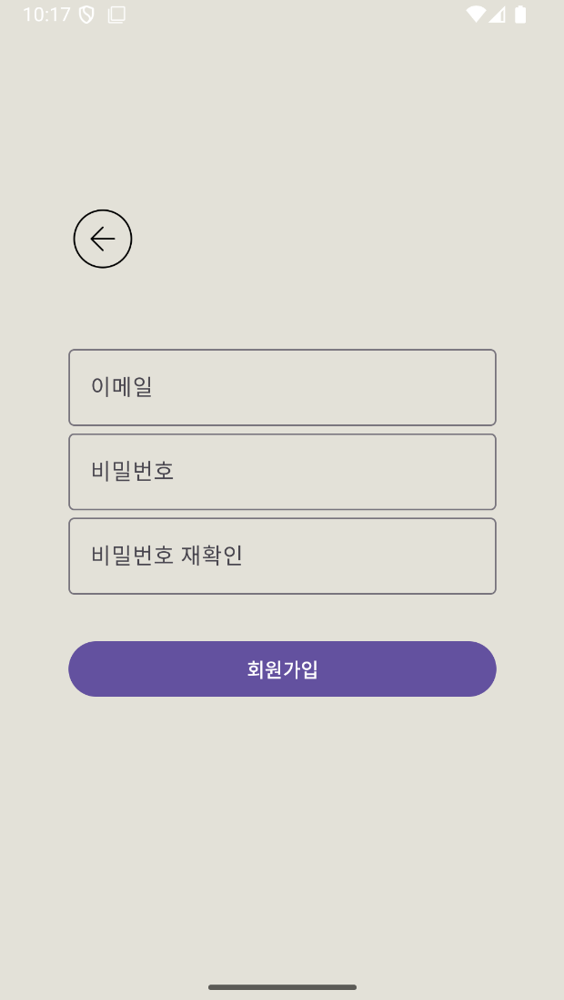
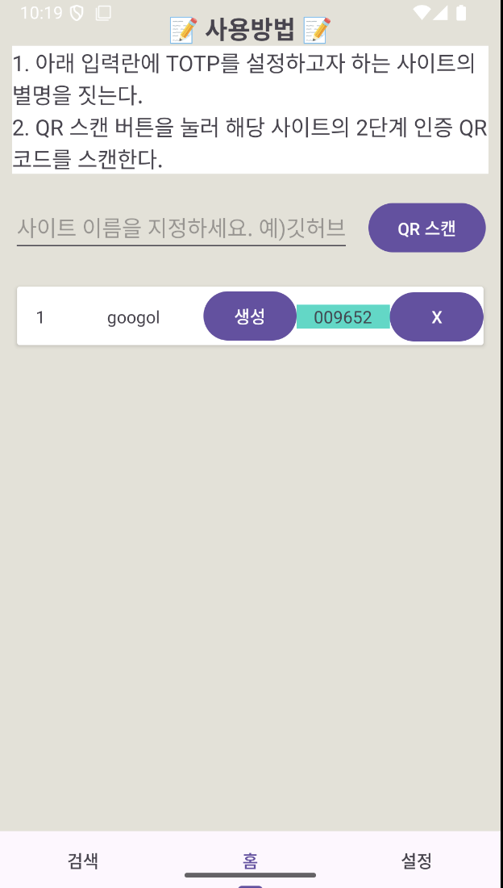
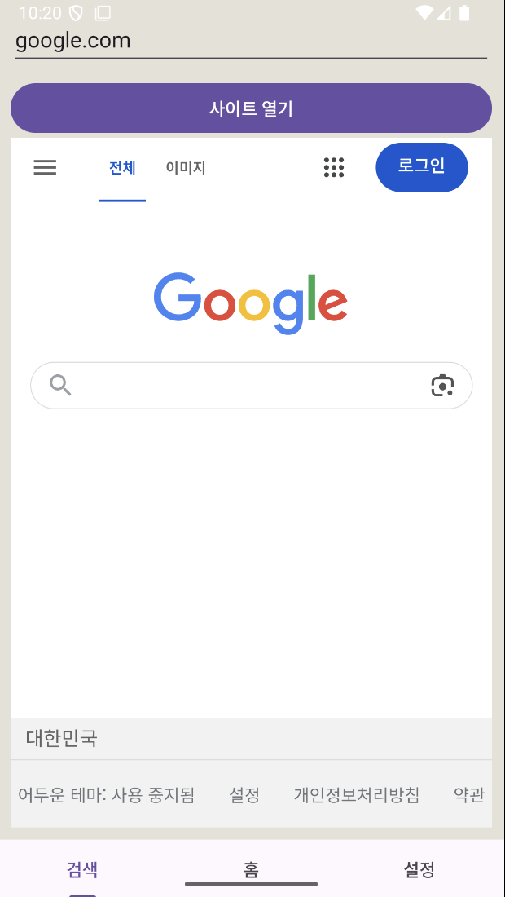
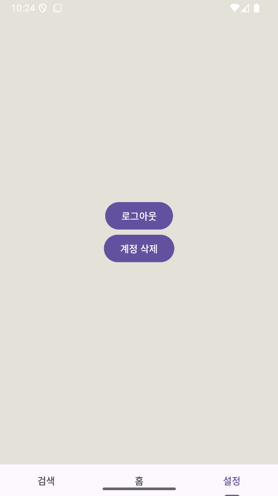

# Tocky 🔐  
안드로이드 기반 TOTP (Time-based One-Time Password) 관리자 앱

## 📱 소개
Tocky는 다양한 웹사이트의 2단계 인증(TOTP)을 안전하게 관리할 수 있도록 설계된 앱입니다.  
QR 코드 기반 계정 등록, 암호화된 저장소, 실시간 OTP 생성 등의 기능을 제공합니다.

## 🛠 주요 기능
- 🔒 **EncryptedSharedPreferences**를 통한 안전한 데이터 저장
- 📷 **QR 코드 스캔**을 통한 계정 추가 (Google Authenticator 호환)
- 🔁 **30초 주기로 자동 갱신되는 TOTP 코드 생성**
- 🧾 **등록 계정 리스트 관리** (생성/삭제)
- 👤 **계정별 로그인 및 데이터 분리 관리**

## 🖼 사용 흐름 예시

### 1. 로그인 화면
- 이메일과 비밀번호 입력 → 계정 인증 후 메인 화면으로 이동

### 2. 메인 화면 (TOTP 목록)
- 현재 사용자 계정에 저장된 사이트 목록 표시
- 각 항목 옆에 "생성" 버튼 → 실시간 OTP 표시
- "QR 스캔" 버튼 클릭 → QR 스캔 화면 진입

### 3. QR 코드 스캔 및 계정 등록
- QR을 스캔하면 자동으로 사이트 정보와 키를 추출해 등록됨

### 4. OTP 생성 및 삭제
- "생성" 버튼 클릭 시 6자리 OTP 코드가 표시됨 (30초 단위 자동 갱신)
- "삭제" 버튼 클릭 시 해당 계정 정보 삭제 가능

> 💡 OTP 코드는 앱 내에서만 확인 가능하며, 저장 정보는 모두 암호화되어 안전하게 관리됩니다.

## 📷 앱 동작 스크린샷
(여기에 각 화면의 스크린샷을 순서대로 넣으세요. 예: 로그인 → 목록 → QR 스캔 → OTP 생성 화면 등)

---

## 💡 기술 스택
- Java 기반 Android
- EncryptedSharedPreferences (AndroidX Security)
- Google ML Kit Barcode Scanner (QR 코드 인식)
- TOTP 생성 로직: RFC 6238 기반 커스텀 구현
- RecyclerView / Fragment 활용한 UI 구성

---

## 📦 프로젝트 구조
