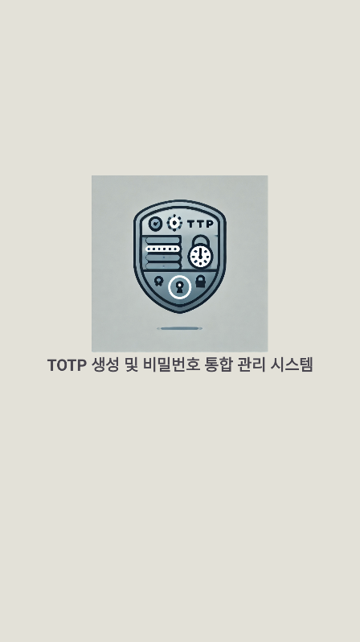

# Tocky 🔐 
안드로이드 기반 TOTP (Time-based One-Time Password) 관리자 앱

## 📱 소개
Tocky는 다양한 웹사이트의 2단계 인증(TOTP)을 안전하게 관리할 수 있도록 설계된 앱입니다.  
QR 코드 기반 계정 등록, 암호화된 저장소, 실시간 OTP 생성 등의 기능을 제공합니다.

## 🛠 주요 기능
- EncryptedSharedPreferences를 통한 안전한 데이터 저장
- QR 코드 스캔을 통한 계정 추가 (Google Authenticator 호환)
- 30초 주기로 자동 갱신되는 TOTP 코드 생성
- 등록 계정 리스트 관리 (생성/삭제)
- 계정별 로그인 및 데이터 분리 관리

## 🖼 전체 기능 흐름

1. 구글, 깃허브 등에서 2단계 인증 활성화 시, 해당 서비스에서 QR이나 비밀키 제공
1. QR을 스캔하여 인증앱에 비밀키를 저장
1. 비밀키는 안드로이드의 EncryptedSharedPreferences 기능을 이용해 안전하게 저장
1. 해당 비밀키를 바탕으로 앱에서 주기적으로 변하는 6자리 TOTP 생성 후 반환
1. 로그인 할때마다, 앱에서 생성한 6자리 숫자 코드를 사이트에 입력해 확인 후 인증

## 📷 앱 동작 스크린샷
<p align="center">
  
  
  
</p>

> 스플래시 이미지 / 로그인 / 회원가입

<p align="center">
  
  
  
</p>

> 검색 / 홈 / 설정

---

## 💡 기술 스택
- Java 기반 Android
- DBHelper (데이터베이스 관리)
- EncryptedSharedPreferences (암호화된 정보 저장)
- qrScanLauncher (QR 코드 인식)
- TOTP 생성 로직: RFC 6238 기반 커스텀 구현
- RecyclerView / ViewPager2 / Fragment 활용한 UI 구성
```kotlin
dependencies {  
    implementation(libs.appcompat)  
    implementation(libs.material)  
    implementation(libs.activity)  
    implementation(libs.constraintlayout)  
    implementation(libs.firebase.inappmessaging)  
    testImplementation(libs.junit)  
    androidTestImplementation(libs.ext.junit)  
    androidTestImplementation(libs.espresso.core)  
    implementation(libs.zxing.android.embedded)  
    implementation(libs.core)  
    implementation("dev.samstevens.totp:totp:1.6.1")  
    implementation("androidx.security:security-crypto:1.1.0-alpha06")  
}
```

---

## 📦 프로젝트 구조
```
app/
├── build/
├── src/
│   ├── androidTest/
│   └── main/
│       ├── java/
│       │   └── com.cookandroid.mobile_…
│       │       ├── database/
│       │       │   └── DBHelper.java
│       │       ├── util/
│       │       │   └── PrefManager.java
│       │       │   └── TOTPUtil.java
│       │       ├── frag1.java
│       │       ├── frag2.java
│       │       ├── frag3.java
│       │       ├── FragmentAdapter.java
│       │       ├── LoginActivity.java
│       │       ├── MainActivity.java
│       │       ├── SignupActivity.java
│       │       ├── SiteAdapter.java
│       │       └── SplashActivity.java
│       └── res/
│           ├── drawable/
│           └── layout/
│               ├── activity_login.xml
│               ├── activity_main.xml
│               ├── activity_signup.xml
│               ├── activity_splash.xml
│               ├── frag1.xml
│               ├── frag2.xml
│               ├── frag3.xml
│               └── row_item.xml
```
---

## 🚀 향후 개선 방안
- 해당 로그인 페이지에서 TOTP 자동완성 기능
- QR 코드 스캔 후 AVD 렉 현상 해결
- 생체 인증(지문/Face ID)으로 앱 접근 제어
